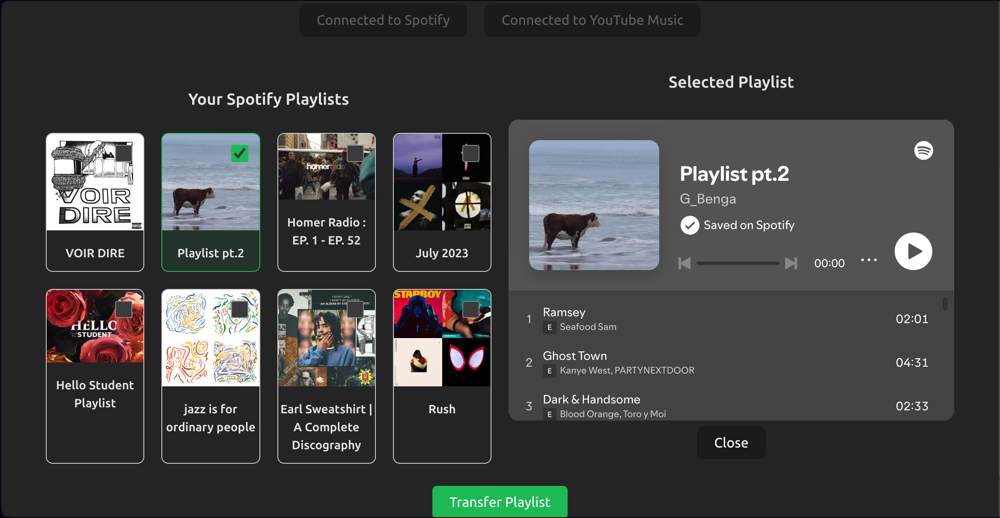
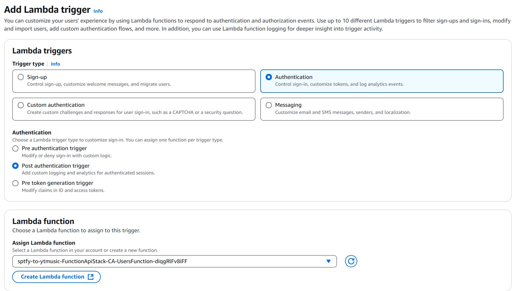

# Playlist Transfer Application

## Overview
The Playlist Transfer Application is a web-based tool that allows users to transfer playlists between Spotify and YouTube Music. This application leverages AWS services for authentication, data storage, and serverless functions, providing a seamless user experience.

---
🚧
I am now working on the transfer logic and a new UI.


This is how the website looks as of now. 
Note: You won't be able to see your spotify playlists if you visit the website just yet because my spotify developer account is in dev mode. 
I can however add you manually to my list of users while spotify processes my extension request.
Feel free to contact me at gbengalawal99@gmail.com



----
## Prerequisites
Before you begin, ensure you have the following:

- A Spotify Developer account
- AWS account with access to AWS Lambda, API Gateway, and Secrets Manager
- Node.js and npm installed on your local machine

---

## Setting Up the Project

### 1. Create a Spotify Developer Account
- Go to the [Spotify Developer Dashboard](https://developer.spotify.com/dashboard/).
- Log in with your Spotify account or create a new account.
- Create a new application to obtain your **Client ID** and **Client Secret**.
- Set the redirect URI in your application settings to match your application's URL.

### 2. Store Spotify Credentials in AWS Secrets Manager
- Log in to your AWS Management Console.
- Navigate to **Secrets Manager**.
- Create a new secret and store your Spotify **Client ID** and **Client Secret**.
- Note the ARN of the secret, as you will need it for your AWS Lambda functions.

### 3. Deploy the Main Stack Using AWS SAM
- Ensure you have the AWS SAM CLI installed. If not, follow the [installation guide](https://docs.aws.amazon.com/serverless-application-model/latest/developerguide/install-sam-cli.html).
- Clone the repository.
- Navigate to the backend directory in your terminal.
- Run the following command to build the application:
  ```bash
  sam build
  ```
- Deploy the application using:
  ```bash
  sam deploy --guided
  ```
- Follow the prompts to configure your stack, including setting up the necessary IAM roles and permissions.

### 4. Manually Add Lambda Trigger from User Pool to User Function
- In the AWS Management Console, navigate to **Cognito**.
- Select the **User Pool** you created for your application.
- Under Authentication click Extensions and **Add Lambda trigger**.



### 5. Starting the Frontend Locally

Ensure you have Vite and React set up for your frontend development environment. If you don't already have them installed, follow these steps:

- Install Vite using npm:
  ```bash
  npm create vite@latest
  ```
- Choose the React template during setup.
- Navigate to the frontend directory of your project in your terminal.
- Install the necessary dependencies:
  ```bash
  npm install
  ```
- Start the development server:
  ```bash
  npm run dev
  ```
- Open your browser and go to [http://localhost:5173](http://localhost:5173) (or the specified port) to view the application.

---

## Features
- **Data storage** using DynamoDB to manage user and playlist information.
- **Infrastructure management** with AWS CloudFormation for automated resource provisioning.
- **Monitoring and logging** with AWS CloudWatch to track application performance and troubleshoot issues.
- **User authentication** using AWS Cognito
- **Playlist management** with Spotify and YouTube Music
- **Serverless architecture** using AWS Lambda and API Gateway
- **Responsive design** for a seamless user experience

---

## Contributing
If you would like to contribute to this project, please fork the repository and submit a pull request with your changes.

